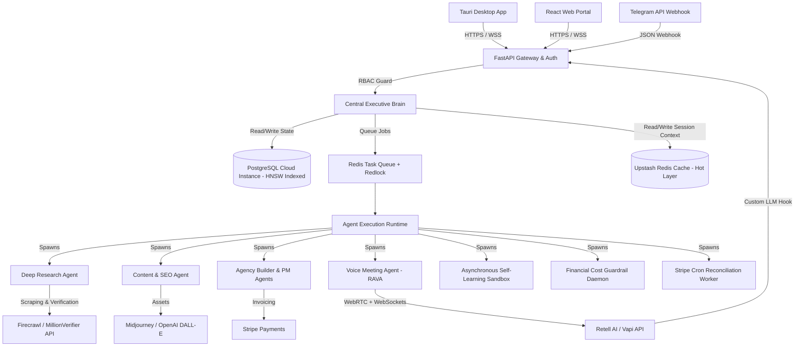
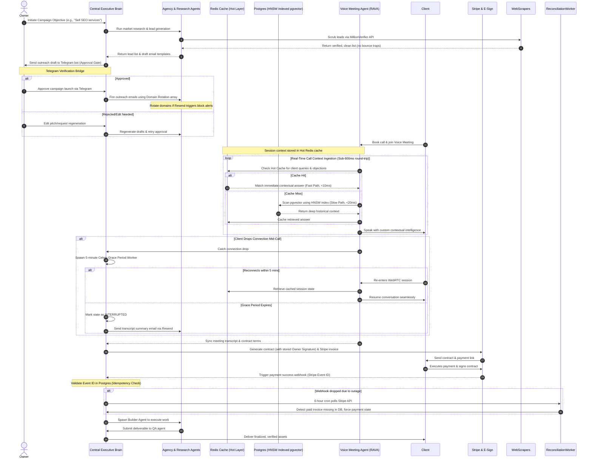

# Core System & User Journey Architecture (FINAL_WORKFLOW)

This document maps out the system topology, multi-channel flow, and key user/agent workflows of the Universal Autonomous Business Engine (UABE).

---

## 1. System Topology

UABE operates as a centralized online backend server communicating with distributed clients (Desktop, Web, Telegram) and dynamic external services.

---

## 2. Core Operational Workflow (with HITL, RAVA, Domain Rotation & Idempotency)

The complete lifecycle showing the human verification, security domain rotation, RAVA context lookup, reconnection grace-periods, and billing reconciliation workflows:

---

## 3. Dynamic Module Extension Workflow (Self-Learning Loop & Staging Prompt Registry)

How the system dynamically adds business capabilities while safeguarding memory integrity:

1.  **Requirement Identification:** The Central Brain identifies a task that requires a tool or API it does not currently have in its `Registry`.
2.  **Research Phase:** The Brain uses the Deep Research Agent to pull down API documentation and library requirements.
3.  **Code Synthesis:** The Brain writes the target Python integration module inside a secure local sandbox environment.
4.  **Dependency Check (Two-Tier):**
    *   If the library is on the pre-approved whitelist, it is automatically `pip` installed.
    *   If not, the brain sends a Telegram request: *"Install library [x] for tool [y]? [Approve / Reject]"*.
5.  **Verification:** The system generates automated test suites to mock the API calls and tests the newly synthesized code.
6.  **Integration:** If the tests pass, the class is registered inside the PostgreSQL database's `BusinessModuleRegistry` and made available for future execution.
7.  **Memory Safeguarding (Staging Registry):**
    *   When the system updates its prompt contexts from open web research, it saves the changes as a `PENDING_PROMPT` in the `Staging Registry` table.
    *   An automated validation script executes the prompt against historical benchmark runs inside the sandbox container.
    *   If the parser throws an error or fails, the update is dropped and the system rolls back to the pinned stable prompt, firing an alert to the Owner via Telegram.
